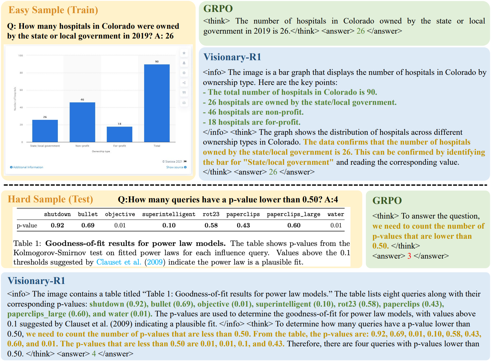

<h1 align="center">Visionary-R1: Mitigating Shortcuts in Visual Reasoning with Reinforcement Learning</h1>
<p align="center"><i>A new RL method for visual reasoning, which significantly outperforms vanilla GRPO, and bypasses the need for explicit chain-of-thought supervision during training.</i></p>

<p align="center">
          🤗 <a href="https://huggingface.co/maifoundations/Visionary-R1">Hugging Face</a>&nbsp&nbsp | &nbsp&nbsp 📑 <a href="https://arxiv.org/pdf/2505.14677">Paper</a> &nbsp&nbsp | &nbsp&nbsp 📖 <a href="https://www.maifoundations.com/blog/visionary-r1/">Blog</a> &nbsp&nbsp 
</p>

This is the official implementation of the paper 'Visionary-R1: Mitigating Shortcuts in Visual Reasoning with Reinforcement Learning'.

# News📰
* **`[2025/06/16]`:**🔥**We have released our code.**
* **`[2025/06/03]`:**🔥**Model checkpoints are available at [[🤗HuggingFace](https://huggingface.co/maifoundations/Visionary-R1)].**
* **`[2025/05/20]`:**🔥**We have released our paper [[Arxiv](https://arxiv.org/pdf/2505.14677)].**

# Overview✈️
We reveal a critical limitation of GRPO when applied to visual language models (VLMs)—the tendency to develop shortcut learning. This finding highlights the need for better training techniques to ensure robust reasoning capabilities. To address the shortcut learning problem, we propose Visionary-R1.

The core component of reinforcement learning involves sampling training data using the policy model. In visual reasoning tasks, the sampled reasoning paths are evaluated based on the final answer. However, due to the shortcut issue—where the model might produce an answer without proper reasoning or disregard the visual input, relying mainly on textual patterns from the question—the samples with correct answers may fail to provide useful reasoning guidance, thus impeding the model’s reasoning abilities.

In the example below, the direct application of GRPO can lead to shortcuts when handling simple samples, as the model can arrive at the correct answer without detailed reasoning. However, this shortcut thinking struggles to generalize to more complex samples, ultimately impairing the model’s overall reasoning ability.



The cornerstone of this approach is a structured caption–reason–answer training format, where the model must first generate a detailed caption of the image before proceeding to reasoning and answering the question.

This structured process ensures that the model doesn’t rely on superficial cues or patterns, as it often does in traditional setups. Instead, the captioning step forces the model to engage in a deeper analysis of the image context. By requiring detailed captions regardless of whether the question is easy or difficult, the framework encourages the model to adopt a consistent, robust problem-solving approach. This not only mitigates shortcut learning but also enhances the model’s ability to generalize across different data distributions.

To further ensure that the captions are meaningful and informative, we apply auxiliary supervision using reinforcement learning from AI feedback. This involves imposing a caption reward, which is combined with standard accuracy and format rewards during policy optimization. The integration of these rewards incentivizes the model to produce captions that are well-structured and contextually rich.


## Main Results🗒️
| Model                   | Size | Strategy | Data | MathVista | MathVision | MMStar | MMBench |
|-------------------------|:----:|:--------:|:----:|:---------:|:----------:|:------:|:-------:|
| **Close-source models** |      |          |      |           |            |        |         |
| GPT-4o                  |   -  |     -    |   -  |    63.8   |    31.2    |  65.1  |   84.3  |
| GPT-o1                  |   -  |     -    |   -  |    71.8   |    63.2    |  67.5  |   83.8  |
| Claude3.5-Sonnet        |   -  |     -    |   -  |    67.7   |    37.9    |  65.1  |   82.6  |
| Claude3.7-Sonnet        |   -  |     -    |   -  |    74.5   |    58.6    |  68.8  |   82.0  |
| Gemini-1.5-Pro          |   -  |     -    |   -  |    63.9   |    19.2    |  59.1  |   73.9  |
| Gemini-2.5-Pro          |   -  |     -    |   -  |    82.7   |    73.3    |  77.5  |   90.1  |
| **Open-source models**  |      |          |      |           |            |        |         |
| Qwen2.5-VL              |  3B  |     -    |   -  |    62.3   |    21.2    |  55.9  |   79.1  |
| InternVL2.5             |  4B  |     -    |   -  |    60.5   |    20.9    |  58.3  |   81.1  |
| MiniCPM-V2.6            |  8B  |     -    |   -  |    60.6   |    17.5    |  57.5  |   81.5  |
| LLaMA3.2                |  11B |     -    |   -  |    51.5   |      -     |  49.8  |   65.8  |
| **Reasoning models**    |      |          |      |           |            |        |         |
| Ovis                    |  4B  |    SFT   |  CoT |    66.6   |      -     |  59.5  |   79.3  |
| Mulberry                |  7B  |    SFT   |  CoT |    63.1   |      -     |  61.3  |    -    |
| R1-Onevision            |  7B  |  SFT+RL  |  CoT |    64.1   |    29.9    |    -   |    -    |
| Insight-V               |  7B  |  SFT+RL  |  CoT |    59.9   |      -     |  61.5  |   82.3  |
| R1-VL                   |  7B  |  SFT+RL  |  CoT |    63.5   |    24.7    |   60   |    -    |
| LLaVA-CoT               |  11B |    SFT   |  CoT |    54.8   |      -     |  57.6  |    75   |
| **Our models**          |      |          |      |           |            |        |         |
| Base Model              |  3B  |     -    |   -  |    61.5   |    19.1    |  52.4  |   82.1  |
| SFT                     |  3B  |    SFT   |  QA  |    54.6   |     7.0    |  61.9  |   80.7  |
| GRPO                    |  3B  |    RL    |  QA  |    61.8   |    20.3    |  54.3  |   78.6  |
| Visionary-R1            |  3B  |    RL    |  QA  |    69.4   |    24.7    |  66.5  |   84.1  |


# Citation🎓
```
@article{xia2025visionary,
  title={Visionary-R1: Mitigating Shortcuts in Visual Reasoning with Reinforcement Learning},
  author={Xia, Jiaer and Zang, Yuhang and Gao, Peng and Li, Yixuan and Zhou, Kaiyang},
  journal={arXiv preprint arXiv:2505.14677},
  year={2025}
}
```
# Acknowledgment
We learned the design and reused code from the following projects: [[MM-EUREKA](https://github.com/ModalMinds/MM-EUREKA)], [[R1-V](https://github.com/Deep-Agent/R1-V)], [[Video-R1](https://github.com/tulerfeng/Video-R1)].

